# Quickstart Guide
**Note**: Each number emoji of this type : 1️⃣, refers to a section of the image in the corresponding section.

## Table of Contents
1. [Getting Started](#1-getting-started)
2. [Sign Up](#2-sign-up)
3. [Login](#3-login)
4. [Dashboard](#4-dashboard)
5. [Creating a Circle](#5-creating-a-circle)
6. [Joining a Circle](#6-joining-a-circle)
7. [Circle Management](#7-circle-management)
8. [Auction System](#8-auction-system)
9. [Admin Panel](#9-admin-panel)

## 1. Getting Started

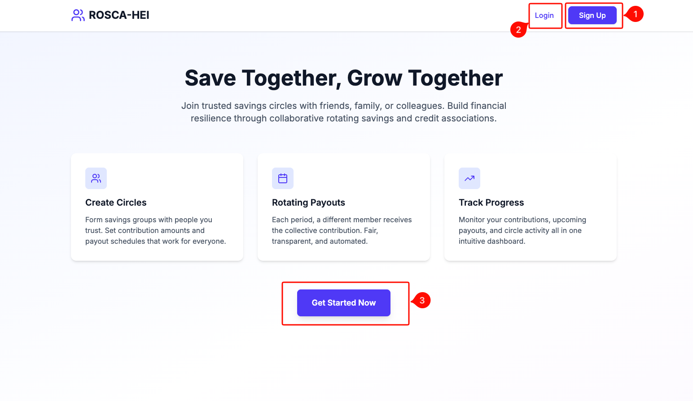

When you first visit ROSCA-HEI, you'll see the homepage explaining the core features of the app.

You have with three main options:

- **Sign Up (button 1️⃣)** - Create a new account
- **Login (button 2️⃣)** - Access your existing account
- **Get Started Now (button 3️⃣)** - Quick access to sign up

## 2. Sign Up

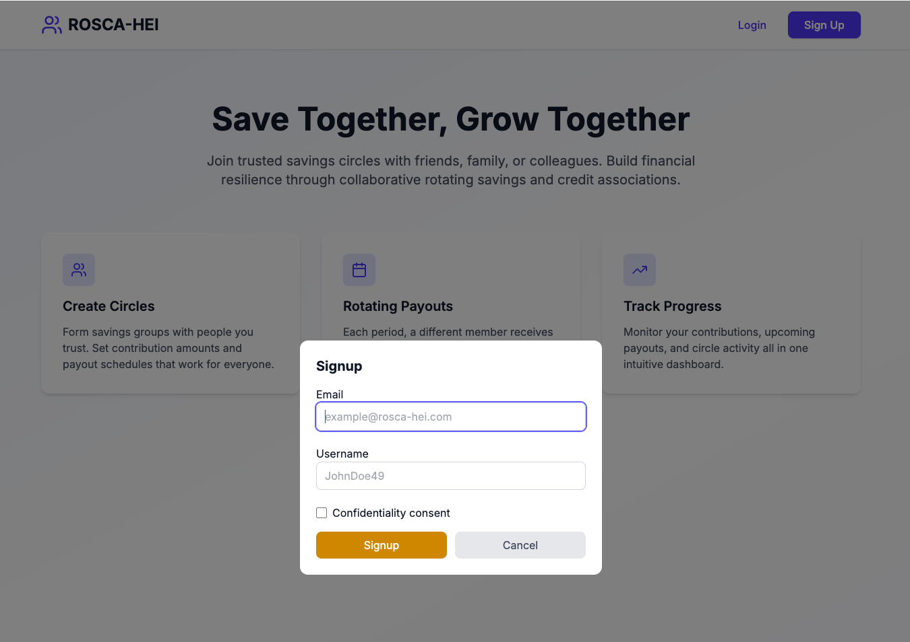

To create a new account:

1. Click **Sign Up** button (button 1️⃣ in homepage)
2. Enter your email address
3. Choose a username
4. Check the **Confidentiality consent** checkbox (optional)"
5. Click **Signup** button

You will be redirected to the [Dashboard](#4-dashboard)

## 3. Login

### Step 1: Enter Your Email

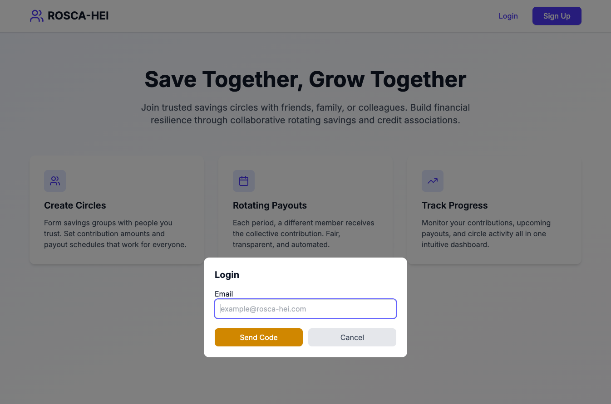

If you already have an account:

1. Click **Login** button (button 2️⃣ in homepage)
2. Enter your registered email address
3. Click **Send Code** button

### Step 2: Check Your Email

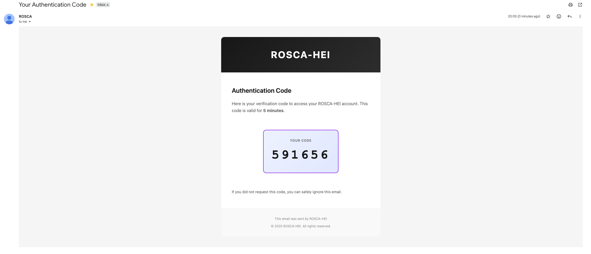

You'll receive an email from ROSCA with your 6-digit authentication code, valid for **5 minutes**.

Just copy this code.

### Step 3: Enter the Code

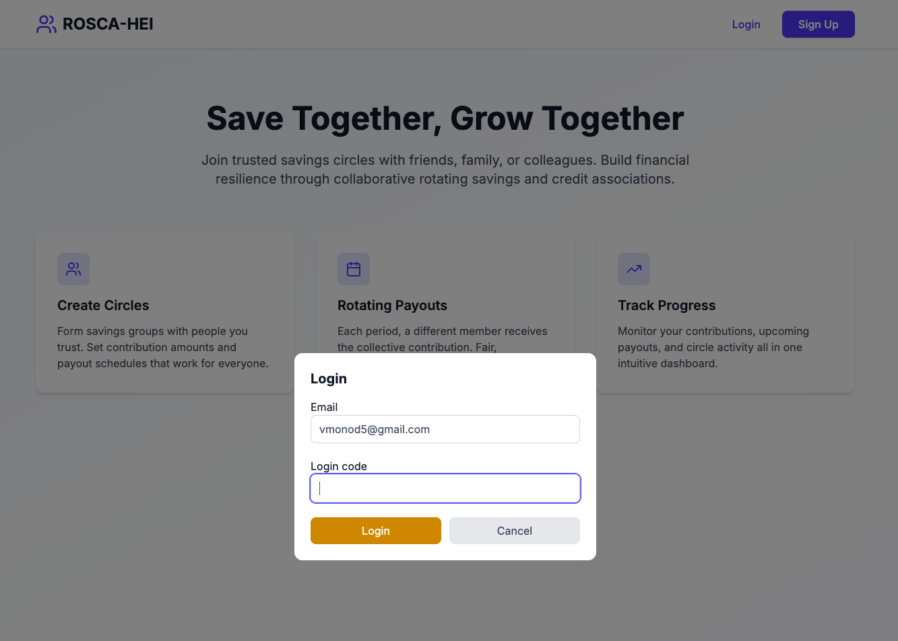

1. Enter the 6-digit in the **Login code** field
3. Click **Login** button

You also will be redirected to the [Dashboard](#4-dashboard)

## 4. Dashboard

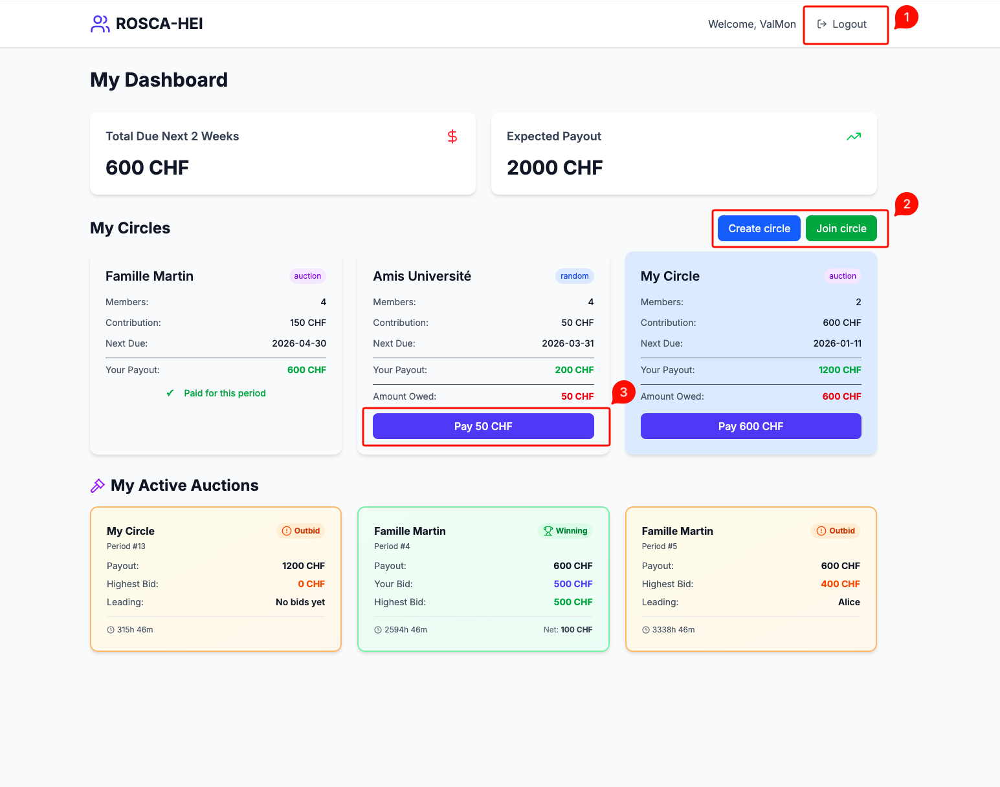

Once logged in, you'll see your personal dashboard:

### Top Section
- Welcome message with your username
- **Logout** button 1️⃣ in the top right

### Financial Summary Section
- **Total Due Next 2 Weeks**: Amount you need to pay
- **Expected Payout**: Total you'll receive when it's your turn

### Circles buttons 2️⃣
- **Create circle** - Create a new circle
- **Join circle** - Join an existing circle

### Circles Section
Each circle card shows:
- Circle name
- Number of members
- Contribution amount per period
- Next due date
- Your expected payout
- Payment status (Paid/Amount Owed)
- **Pay button 3️⃣**

When you click on a circle, you'll see detailed information

### Auctions sections
- Shows circles with active bidding
- Your current bid status
- Highest bid and leading member
- Time remaining

When you click on a auction, you'll see detailed information

## 5. Creating a Circle

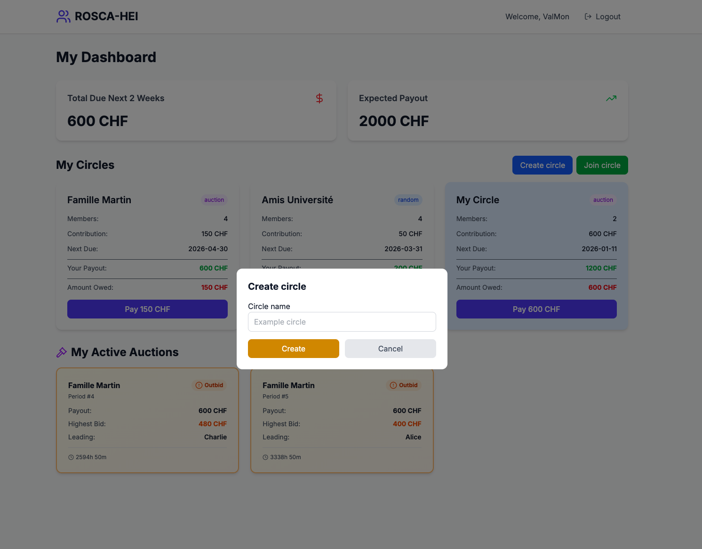

To create a new circle:

1. Click **Create circle** button from dashboard
2. Enter a **Circle name**
3. Click **Create** button

The circle will now appear in your circles section.
The circle background in blue mean that you are the admin of the circle.

## 6. Joining a Circle

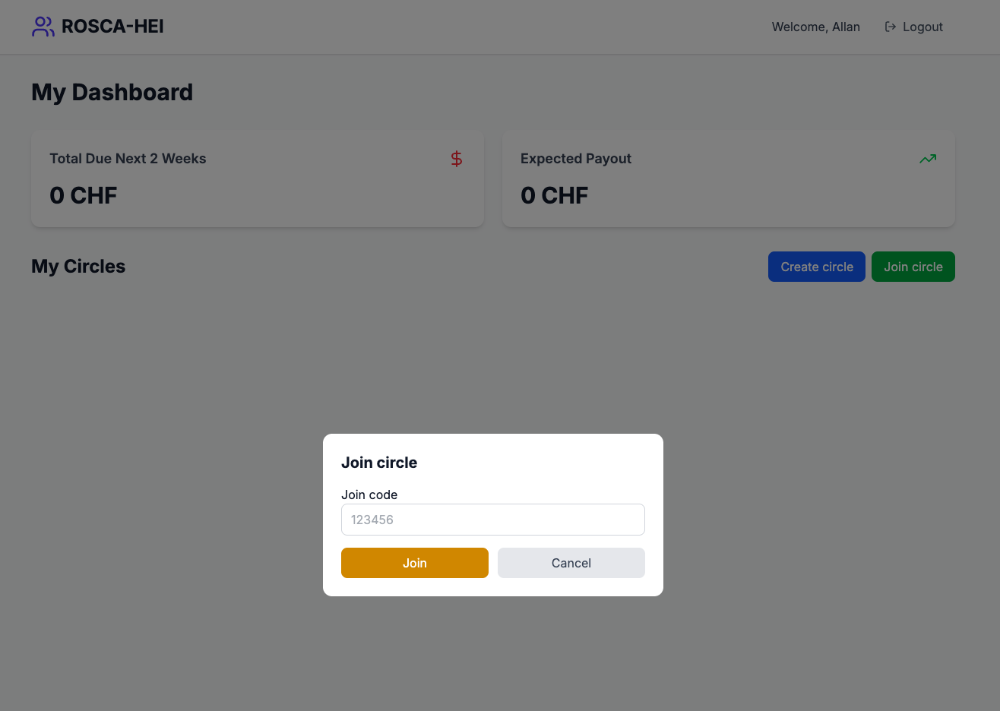

To join an existing circle:

1. Click **Join circle** button from dashboard
2. Enter the **Join code** provided by the circle creator
3. Click **Join** button

The circle will now appear in your circles section

## 7. Circle Management

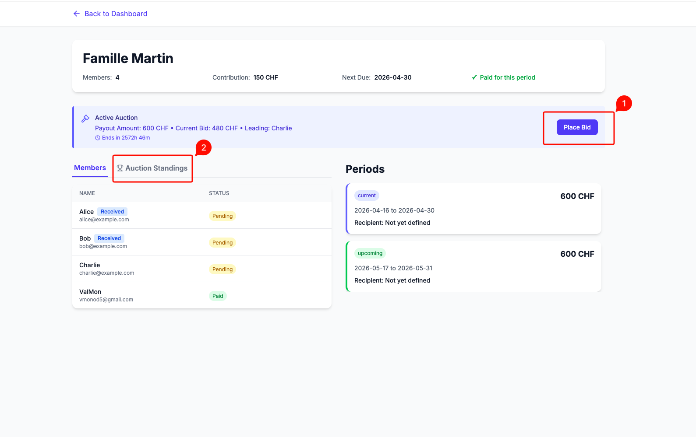

### Circle Header
- Circle name
- Members
- Contribution per period
- Next due date
- Payment status

### Auction Section (if enabled)
- Shows active auction details
- **Place Bid** button 1️⃣ - Submit your bid to receive payout early
- **Auction Standings** tab 2️⃣- View current bids

### Members Tab
Shows all circle members with:
- Name and email
- Status badges (Received, Pending, Paid)
- Payment status for current period

### Periods Section
Lists all contribution periods:
- **Current period** (blue border) - Active period
- **Upcoming periods** (green border) - Future periods
- Period dates
- Payout amount
- Recipient (or "Not yet defined")

## 8. Auction System

### Placing a Bid

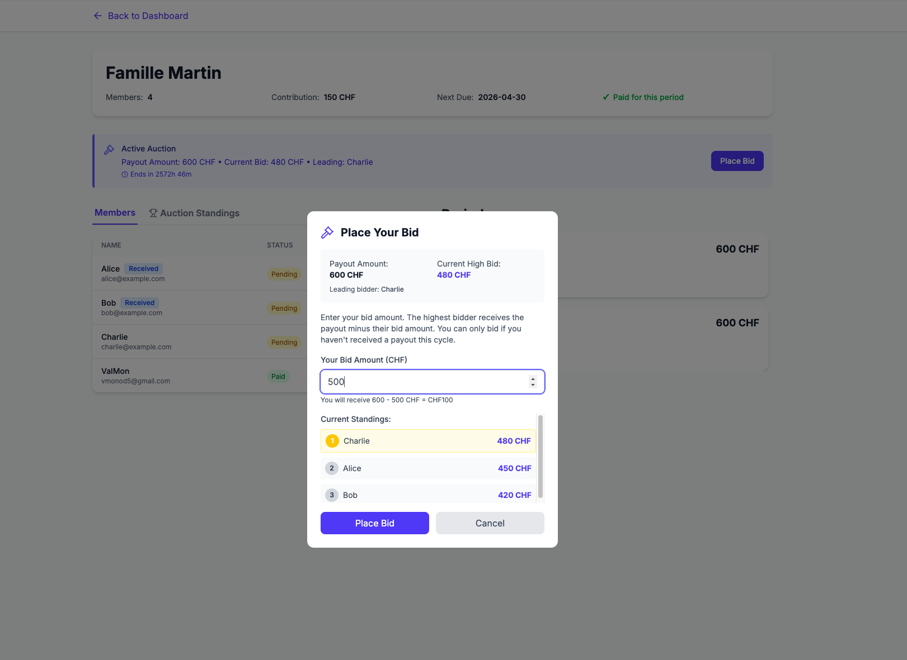

In auction mode, members can bid to receive the payout before their turn:

1. Click **Place Bid** button (button 1️⃣ in circle page)
2. See current auction information:
   - Payout Amount
   - Current High Bid
   - Leading bidder
3. Enter **Your Bid Amount**
   - You need to bid more than the current winner
4. View **Current Standings** showing top 3 bids
5. Click **Place Bid** to submit

The highest bidder receives the payout but pays the bid amount.

### Viewing Auction Standings

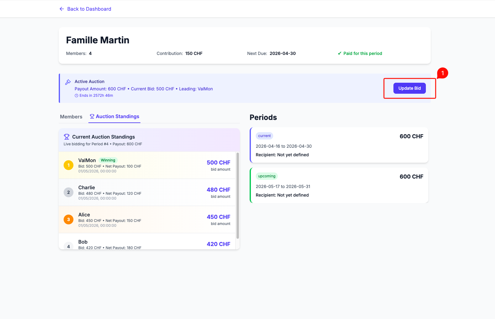

Click **Auction Standings** tab (button 2️⃣ in circle page) to see:

**Current Auction Standings:**
- Live bidding for the period
- Payout
- Rankings

**Update Bid** button 1️⃣ allows you to revise your bid

## 9. Admin Panel

### Users Management

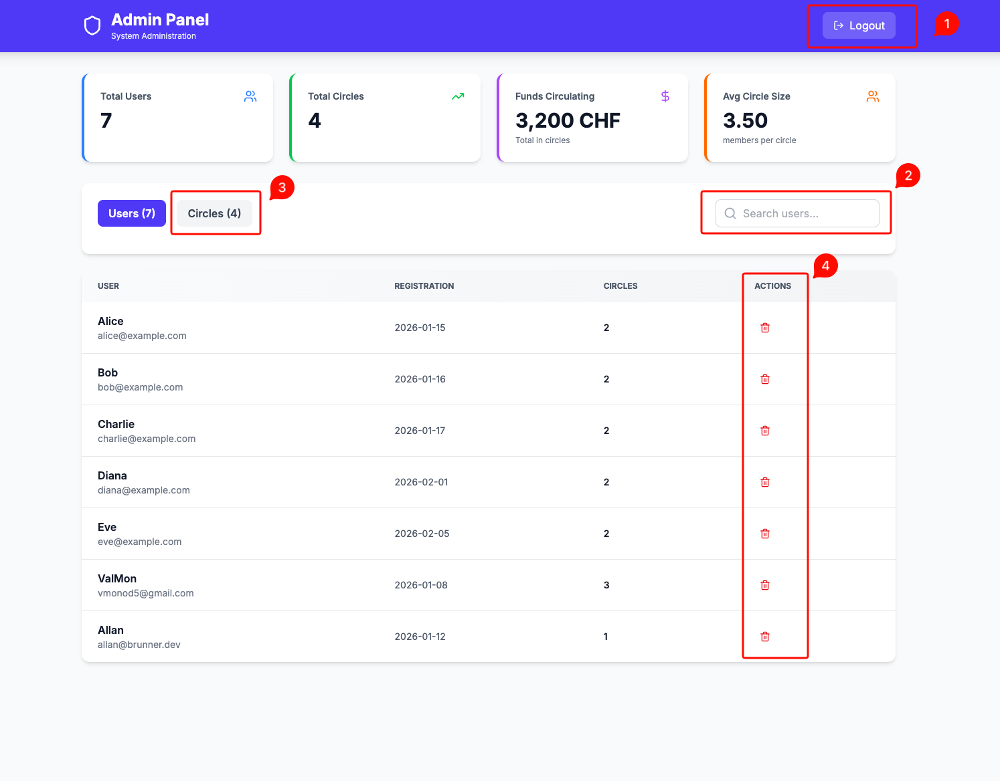

System administrators can access the admin panel to manage the platform:

### Top Navigation
- **Logout** button 1️⃣
- **Search users** bar 2️⃣ - Filter users by name or email
- **Users** tab - View all registered users
- **Circles** tab 3️⃣ - Switch to circles view

###  Global stats section
- Total Users
- Total Circles
- Funds Circulating
- Avg Circle Size

### Users tab
Displays all users with:
- Username and email
- Registration date
- Number of circles
- **Actions** column with delete (🗑️) button 4️⃣ option

### Circles tab

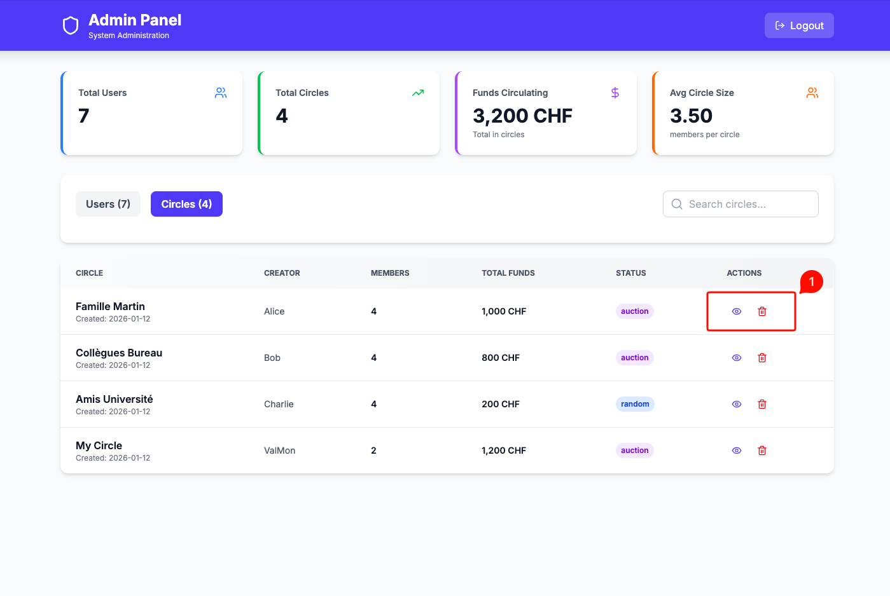

Switch to **Circles** tab to manage all circles:

**Circles Table:**
Shows each circle with:
- **Circle name** and creation date
- **Creator** - Who created the circle
- **Members** - Number of participants
- **Total Funds** - Money circulating in the circle
- **Status** - Payout mode (auction/random)
- **Actions** - View (👁️) or Delete (🗑️) buttons 1️⃣
